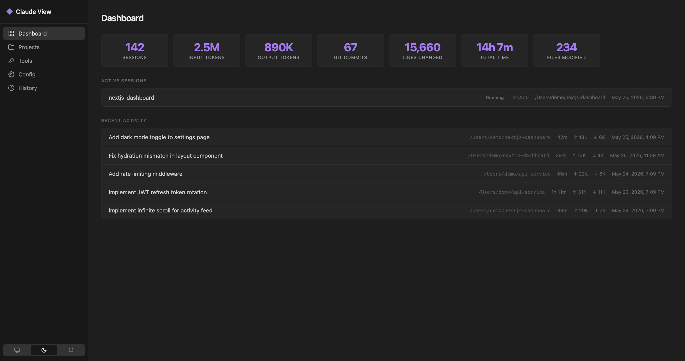
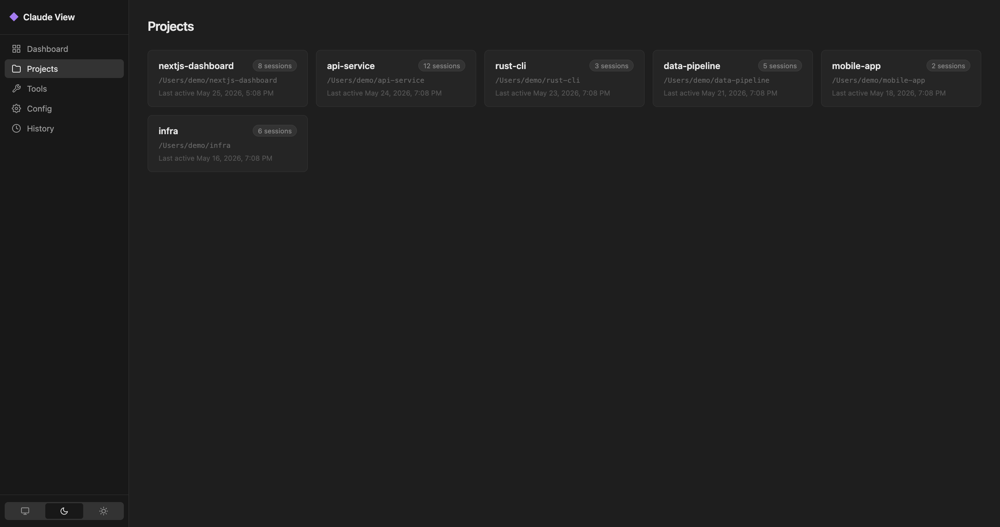
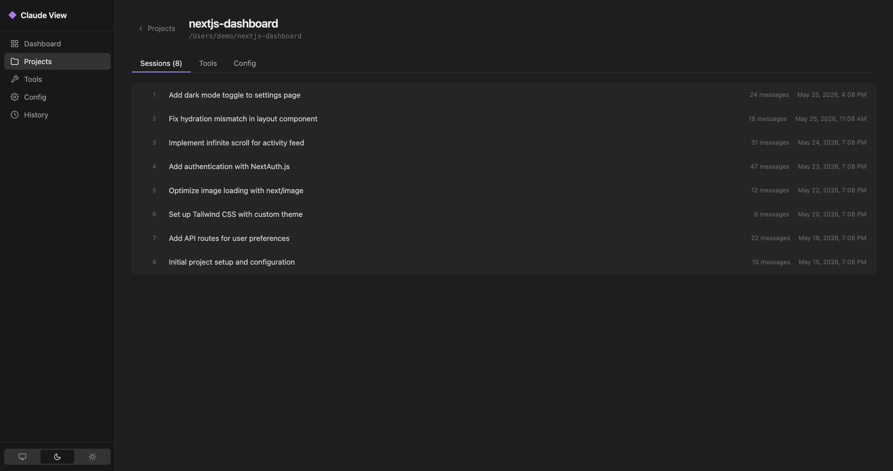
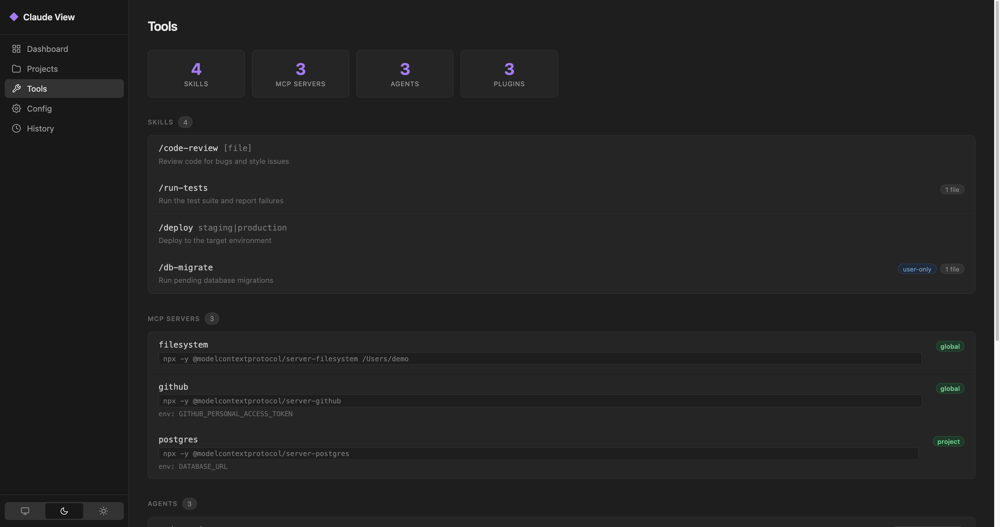
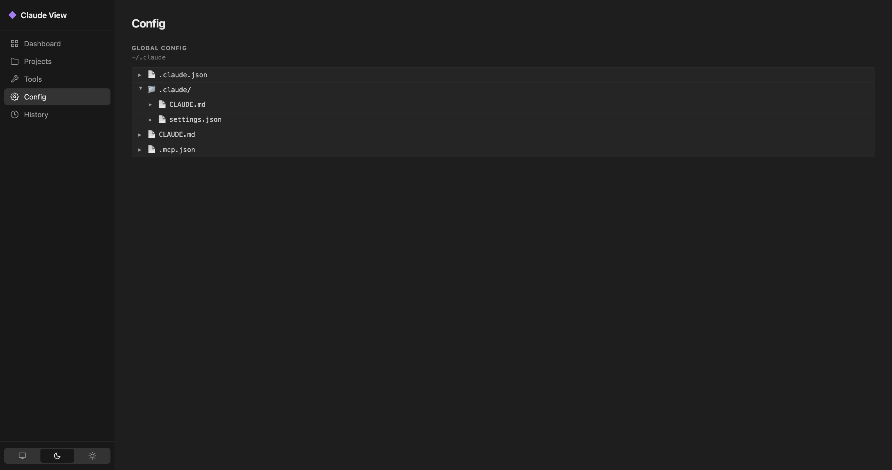

# Claude View

A local dev tool for viewing Claude data.

## Screenshots

**Dashboard**


**Projects**


**Project Sessions**


**Tools**


**Config**


## Prerequisites

- [Node.js](https://nodejs.org/) v18 or later

## Setup

```bash
git clone https://github.com/jithinlalk25/claude-view.git
cd claude-view
npm install
```

## Run

```bash
npm start
```

Open [http://localhost:3000](http://localhost:3000) in your browser.

### Development mode (auto-restart on file changes)

```bash
npm run dev
```

## Configuration

Set the `PORT` environment variable to use a different port:

```bash
PORT=8080 npm start
```
